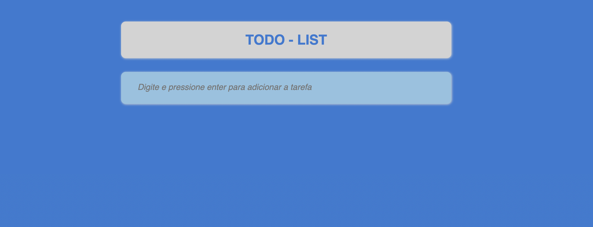

# 📝 **TODO List Application**

> Um gerenciador de tarefas interativo e funcional feito com HTML, CSS e JavaScript. Este projeto permite criar, marcar como concluído, e excluir tarefas, com os dados armazenados localmente no navegador.

  


---

## 📖 **Sobre o Projeto**

Esta aplicação é um simples _to-do list_ projetado para ajudar na organização de tarefas diárias. Com um design limpo e funcional, ele oferece:

- ✅ Adicionar novas tarefas pressionando Enter.
- ✏️ Marcar tarefas como concluídas.
- ❌ Excluir tarefas existentes.
- 📦 Armazenar tarefas usando o `localStorage`.
- 🚨 Prevenção contra duplicação de tarefas, exibindo alertas amigáveis.

---

## 🛠️ **Tecnologias Utilizadas**

- 🌐 **HTML** - Estrutura da aplicação.
- 🎨 **CSS** - Estilização e responsividade.
- ⚡ **JavaScript** - Lógica da aplicação e manipulação do DOM.

---

## 🚀 **Como Usar**

1. Clone o repositório:
   ```bash
   git clone https://github.com/bdancost/todoList.js.git
   ```
2. Navegue até o diretório do projeto:
   ```bash
   cd todo-list
   ```
3. Abra o arquivo `index.html` em seu navegador.

---

## 📂 **Estrutura do Projeto**

```plaintext
📦 todo-list
├── 📄 index.html    # Estrutura do aplicativo
├── 📄 style.css     # Estilo do aplicativo
└── 📄 app.js        # Lógica do aplicativo
```

---

## 🖼️ **Visual do Aplicativo**

![Screenshot da Aplicação]
  
_Imagem ilustrativa do projeto em execução._

---

## 📋 **Funcionalidades**

1. **Adicionar tarefas:**  
   Digite no campo de entrada e pressione Enter para adicionar uma nova tarefa.

2. **Prevenir duplicação:**  
   Se a tarefa já existir, será exibido um alerta amigável.

3. **Marcar como concluída:**  
   Clique na caixa de seleção para marcar uma tarefa como concluída.

4. **Excluir tarefas:**  
   Clique no botão "X" para excluir uma tarefa.

---

## 🧑‍💻 **Contribuindo**

Contribuições são bem-vindas! Siga os passos abaixo para contribuir:

1. Faça um _fork_ deste repositório.
2. Crie uma nova _branch_:
   ```bash
   git checkout -b feature-minha-feature
   ```
3. Faça suas alterações e faça o _commit_:
   ```bash
   git commit -m "Minha nova feature"
   ```
4. Envie para o repositório remoto:
   ```bash
   git push origin feature-minha-feature
   ```
5. Abra um _Pull Request_.

---

## 📝 **Contato**

📧 **Email:** [seu-email@example.com](mailto:pr.danfc88@gmail.com)  
🌐 **Portfólio:** [seu-portfolio.com](Em Preparo...🚀🚀)

**Desenvolvido por [Daniel Fernandes](https://github.com/bdancost).**
